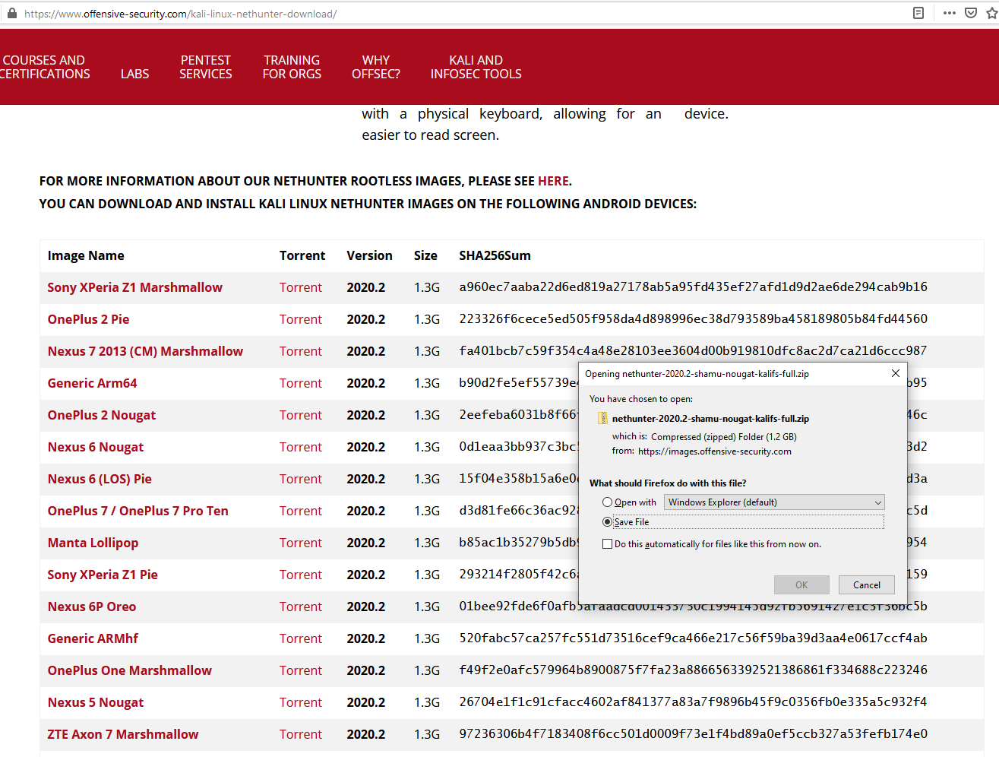

_Please view all instruction as educational and for learning purposes ONLY. Use of these examples against targets in the real world without permission is unethical and illegal..._

# Kali Nethunter Install Tutorial 


This tutorial covers how to do a fresh install of Kali Nethunter onto a rooted Nexus 6. 
In writing this the author assumes you already have a familiarity with windows command prompt and the windows OS and an understanding
of what rooting a phone does as well as the dangers.  <span style="color: red;">YOU CAN BRICK YOUR DEVICE IF YOU ARE NOT CAREFUL</span>. I am not responsible if you 
do somehow damage or brick your device. Do your research and understand the risks involved with this process. 
If you use another device besides the Nexus 6 I cannot guarantee it will work but the steps should be similar. Please go read up on the XDA forums for your SPECIFIC DEVICE BEFORE attempting to root it. Here are the XDA forums I visited for this project. 

<span style="color: cyan;">https://forum.xda-developers.com/google-nexus-5/help/faq-to-android-read-post-root-t2508292</span>

and

<span style="color: cyan;">https://forum.xda-developers.com/nexus-6/general/how-to-nexus-6-one-beginners-guide-t2948481</span>


If your nexus device is fresh out of the box, please set it up with no password or pin. Also take a backup of pictures and contacts
before because the phone data will be erased. 

### This guide consists of 3 parts
1. Gathering necessary tools and files and installing Nexus root kit drivers. 
2. Booting to a custom recovery image (TWRP) and rooting the phone (Magisk).
3. Flashing and installing Kali Nethunter. 


### Hardware Requirements

* Desktop Computer or Laptop

* Nexus 6

* Micro USB Charging Cable

### Emotional Requirements

* Patience

* Determination

## STEP 1) Software Requirements

Start by downloading the required tools. 


* Android SDK Platform Tools

	<span style="color: cyan;">https://developer.android.com/studio/releases/platform-tools#download</span>

Download and unzip. 


Don't forget where you put it...

* Nexus root toolkit

	<span style="color: cyan;">https://nexus-root.com/download/</span>


Go ahead and save/run the executable.


Install.


At this point it asks for our device.


I simply used the auto detect option 


Here we can see the NRT main menu and log file. 
We will stop here to download the necessary .apk and .zip files.

### Files Requirements

Now continue by downloading the files below.

* Magisk
	
	<span style="color: cyan;">https://magisk.me/</span>


	Magisk is the "app" that will allow us to have root privileges on our Nexus 6.
	Here is the main web page.


When you scroll down the page you will see the downloads. You will download 2 files. One is the flashable zip file and the other is the Magisk app that will be installed. 


The download link takes you to another page so make sure you scroll down past the ads to get the real download...


* TWRP Recovery

	<span style="color: cyan;">https://dl.twrp.me/shamu/twrp-3.0.2-0-shamu.img.html</span>


	This will be our custom recovery that will allow us to boot and install Magisk.

* Kali Nethunter 

	<span style="color: cyan;">https://www.offensive-security.com/kali-linux-nethunter-download/</span>


	Scroll down the page and find the Nexus 6 Nougat download.



* Stock Image

	<span style="color: cyan;">https://developers.google.com/android/images#shamu</span>


	I downloaded the stock img for my Nexus 6 build number. Yours may be slightly different. 
	To check your build number, open your Nexus device, go to settings > about phone > go to bottom.
	Mine was NBD91P. This way you at least have a backup plan if you F*** something up. Nexus Root Toolkit
	has an options for flashing the original factory image back onto the phone. 


## STEP 2) TWRP & Magisk install

After we have all the required files and software, we can begin to install our software onto the Nexus 6. 
One more tip that will help your anxiety in this process is to be patient. Sometimes Nexus Root Toolkit
will ask you to wait so you need to have a shred of confidence in the tool and let it run its course. DO NOT close 
unless you are sure it is hanging. 9/10 times it is just running like normal just let it run. When you first open 
Nexus Root Toolkit it opens the main menu and a "live log". 


Click the install drivers button and CAREFULLY and METICLOSLY follow each step.


If everything is done correctly you will run the Full Driver Test and get these results in your logs. If done successfully your phone will also be rebooted from the PC. 


If your phone reboots successfully but you see this image hanging for more than 5 min you need to go into your phone and turn on usb file transfer. See below. The phone should remain plugged in while doing this.....


Once changing it to file transfer you should see this success message from Nexus Root Kit!


Next follow the Nexus Root Toolkit instructions for unlocking the bootloader.
Just like in the driver install guide it is very self-explanatory. If you have issues someone else on
the internet has fully documented this process. Do your research.


Ok you are almost ready to root!

Lets move all our files over to the phone. 


Now making sure your phone is plugged in and that you can see internal storage, open your file explorer to where
you placed your Android SDK Platform Tools and copy this path into a command prompt. If you are confused about this part
please stop and google "Traversing the windows file system in CMD". In this step we will be flashing the custom TWRP recovery image to our phone. 
From here we will install Magisk and root the phone!
```
.\adb devices
```
We can see below that my device has been identified. If you do not see your device try to enable file sharing on the nexus 
device.


Next you will reboot to the android bootloader. Your phone should shut off and boot to the android boot loader screen. 

```
.\adb reboot bootloader
```


Now you will run several fastboot commands. When you look at my output below, notice that I placed the full path (C:\) to the TWRP image I downloaded. To
do this either navigate to the file and copy the path from the top bar of file explorer, or simply drag and drop the file
into the command prompt. 

```
.\fastboot flash recovery "C:\PATH\TO\YOUR\TWRP-FILE.IMG"
```
Once you run this command below your phone will boot to TWRP custom recovery!

```
.\fastboot boot "C:\PATH\TO\YOUR\TWRP-FILE.IMG"
```


After swiping on the modification button, we see the main TWRP menu system. 
Select the Install option...


Browse to where you copied the files onto your nexus internal storage. For me it was Download.
Select the Magiskv20.4.zip and press Install Image...


Swipe to confirm flash...


If your file is not corrupted, you should see a successful install.


Press Reboot System. 


When the phone reboots go into your apps and check to see if the Magisk Manager was installed.
If it was drag Magisk onto the home screen as it will save you time.
Open Magisk Manager...


Ensure that both Magiask and the Manager are up to date and installed. 


When we click the upper left menu, we see that SuperUser is an option. 

Congratulations you have successfully rooted your Nexus 6!


## STEP3) Flashing Nethutner

Because we have Magisk installed we should be able to access the bootloader and boot
to our custom recovery image, TWRP.

Hold the power and shut the phone off
Once it is off power it back up by pressing power + volume down at the same time. 
This will boot you to recovery. For a faster option plug your phone in and run these two commands again.
```
.\adb devices
```

```
.\adb reboot bootloader
```

Here we can move up the menu by the volume up button until we reach the Recovery option.
Press the power button once to select.


Just like when we installed Magisk, select the nethunter image and swipe to install.


We see it is loading up! Please be patient as we see it can take up to 25 minutes. This only took
about 7 min for me. When it is finished reboot.


I hope dear reader that when you finish the last step you boot to this beautiful image. 


After boot we also see the kali home screen.


Drag all the nethunter related apps to the home screen for easier use. 
DONT OPEN ANY OF THEM JUST YET...
Open the nethunter app first. It is the gray one.


This next part is the whole reason we installed the Magisk app. Magisk allows us to grant apps
super user or root access. Go ahead and press GRANT...


Now you need to grant Kali chroot access. Open the side menu and select
the Kali Chroot Manager...


On the bottom left click START KALI CHROOT...


Now Nethunter has chroot access and you can access the full potential of your Nexus 6 Kali Nethunter!


Have fun checking out the rest of Nethunter!


## After thoughts or troubles. 

This guide was created to help other cyber security students and professionals with minimal android development knowledge to
successfully install Nethunter onto a Nexus 6 device. If you experience any issues when following this guide please do your 
due diligence in researching the topic of rooting and what you are doing to the device! If you have done this 
are you are still stumped feel free to reach out to me at SudoZeus@protonmail.ch or on Instagram @sudo_zeus! 

Happy hacking.

sudo_zeus

[Back](./)
