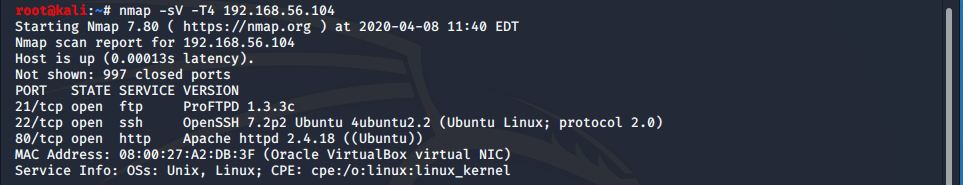
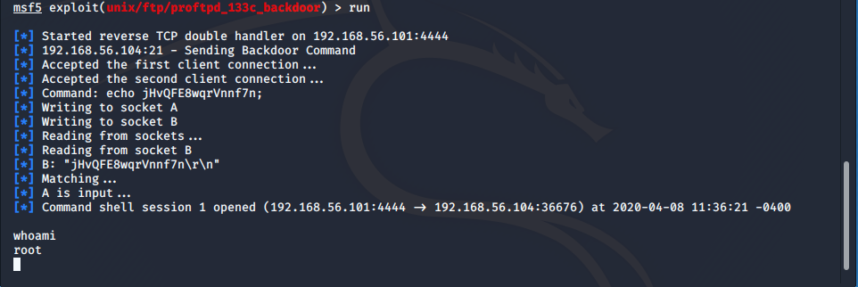
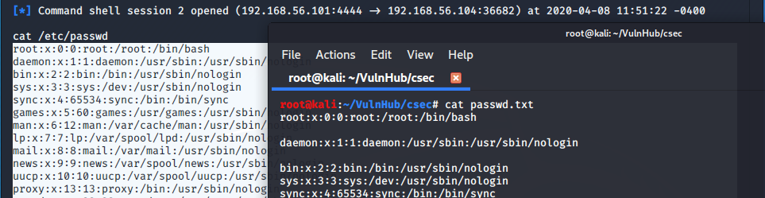
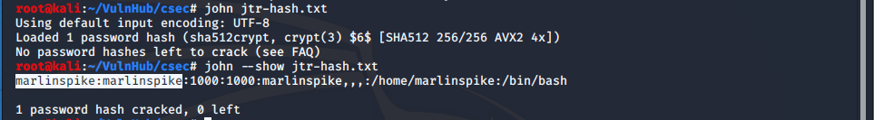
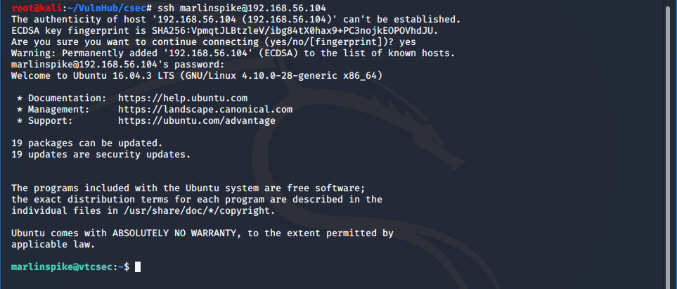
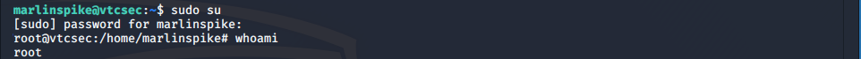
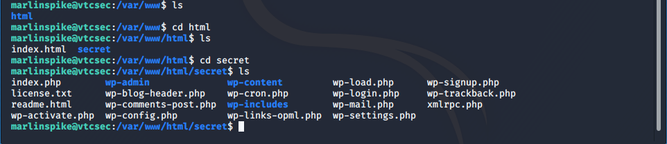
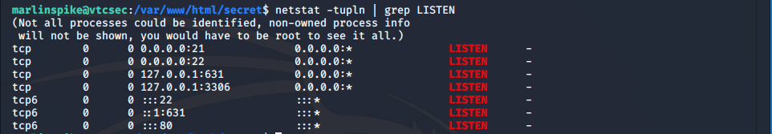
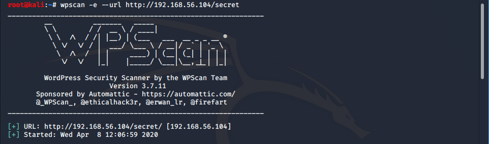
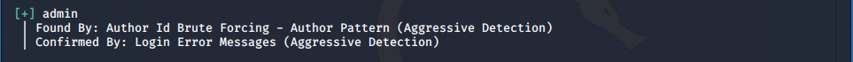

_Please view all demostrations as educaitonal and for learning purposes ONLY. Use of these examples aginst targets in the real world without permission is unethical and illegal_

## Basic pentesting 1 (CSEC)

_CSEC is a vulnerable machine located on vulnhub. https://www.vulnhub.com/entry/basic-pentesting-1,216/
Many thanks to Josiah Pierce_




I started with a port and version scan using nmap. As we can see it reveiled several regularly used ports.
* port 21 - ftp
* port 22 - ssh
* port 80 - http

With the service versions that were returned by nmap I employed searchsploit to see if there was any low hanging fruit, begining with FTP.
```
searchsploit proftpd-1.3.3c
```
What came back was a Metasploit module for backdoor command execution.
Booting up Metasploit I ran a search command for the module, assigned it for use, and set the paramaters.
```
msf5 > search proftpd
```
```
use unix/ftp/proftdp_133c_backdoor
```
```
set RHOSTS <ip>
```
I used the <span style="color: red;">show missing</span> command to see if I had overlooked any options for the exploit, and when I was absolutly sure everything was correct, typed <span style="color: red;">run</span> and initiated my attack. 



The reverse tcp shell was successful. 
After issueing a <span style="color: red;">whoami</span> command and watching <span style="color: red;">root</span> return it was time to see what other avenues I could find.

With my backdoor already in place I decided to pull the hashed passwords and try to crack them offline. I ran a <span style="color: red;">cat</span> command on both <span style="color: red;">/etc/shadow</span> and <span style="color: red;">/etc/passwd</span> and copied the output back to .txt files on my attcking machine named shadow.txt and passwd.txt respectivly.



Back on my machine in a terminal window I used the <span style="color: red;">unshadow</span> command on the passwd.txt and shadow.txt files. 
This created a file named jtr-hash.txt formated for John the Ripper, the password cracking utility. 
Next I ran the commands to start John and pointed it at my hashed file. 
```
unshadow passwd.txt shadow.txt > jtr-hash.txt
```
```
john jtr-hash.txt
```
It cracked the hash in a matter of minuetes. I ran the next command to display the user & password for the hash file I had just cracked. 
```
john --show jtr-hash.txt
```


As we can see in the output the username and password were exactly the same. 
Sometimes its the simple things that can be the weakness. I may have been able to brute force SSH using the username alone and gotten access just the same!

Anyway now that I had credientals I shifted focus to the SSH service running and tried to login. 
```
ssh marlinspike@192.168.56.102
password:marlinspike
```


Of course it worked and as all hackers say...IM IN. I issued one last <span style="color: red;">sudo su</span> command and, using the password, was given access to a <span style="color: red;">root</span> shell.



Now came the opportunity to poke around some more.
Because I found the default landing page for the HTTP service and out of curosity I started enumerating a few key directories to see what I could find. 
```
 cd /var/www/html
```
I found a directory named secret running a WordPress service!



Now I wanted to check what port this 'secret' WordPress was running on.

```
netstat -tupln | grep LISTEN
```



After determining it was running on the localhost I employed the use of a great enumeration tool for WordPress, <span style="color: red;">WPScan</span>. 

```
wpscan -e --url http://192.168.56.102/secret
```


It returned a lot of useful infromation including potentially vulnerable theme and versions. But it also returned some more hacker <span style="color: gold;">gold</span>.



Again a default username was left for the WordPress login form. After a quick check I verified that the username was also the password. :)

# Conclusion

This was a great beginnner box and I had a lot of fun both hunting the exploits and documenting my findings with this writeup!

This is my first writeup and I plan to do many more! It gives great hindsight to the budding pentester. It also allows you to structure the information in a logical way to eventually present your findings to others.

If anyone has any questions or comments feel free to contact me at SudoZeus@protonmail.ch.

THANK YOU!

[Back](./)
